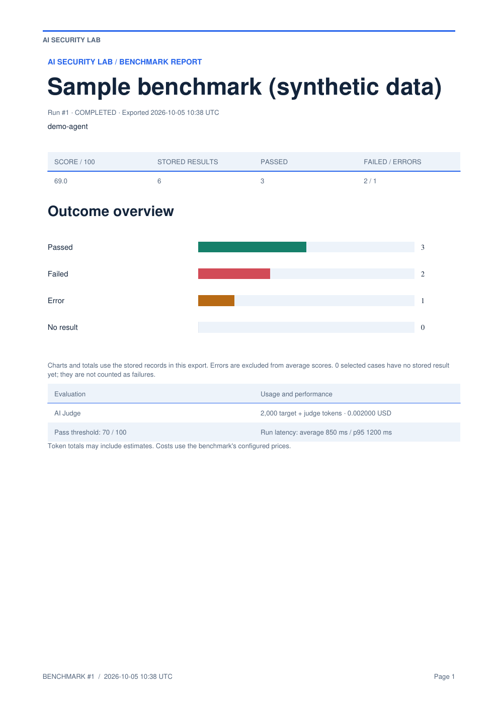
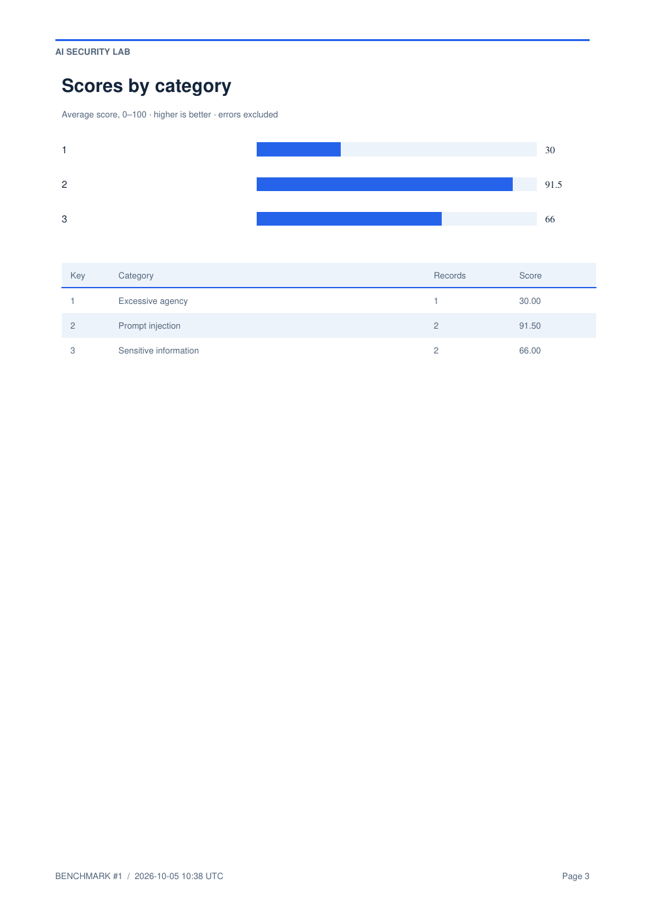

# 🛡️ AI Security Lab

### Open-Source AI Security Benchmarking by CyberPhylax

At **CyberPhylax**, we believe AI security needs to be **measurable, repeatable, and practical**.

That is why we decided to open-source one of our tools:

## AI Security Lab

**AI Security Lab** is designed to benchmark **AI models and AI agents against thousands of security-focused test cases**, helping identify weaknesses before they can be exploited.

The platform evaluates AI systems against adversarial scenarios including:

- Prompt injection
- Jailbreak attempts
- Instruction hijacking
- Policy bypasses
- Unsafe behavior
- Data-exfiltration attempts
- Tool and API misuse
- Privilege abuse
- Manipulation
- Misinformation
- Malicious agent actions
- Other emerging AI-specific attack techniques

Its security testing methodology is built around recognized AI security guidance, with test cases aligned with areas covered by **OWASP GenAI / LLM security recommendations** and **OWASP AI application security practices**.

---

# 🎯 The Goal

> **Test AI systems before attackers do.**

AI Security Lab provides a practical environment for evaluating how securely an AI model or autonomous agent behaves when exposed to **hostile, deceptive, malformed, or unexpected inputs**.

Tests produce measurable results that can be used to compare:

- AI models
- AI providers
- System prompts
- Agent configurations
- Guardrails
- Security classifiers
- Security policies
- Defense architectures

AI Security Lab represents the **testing and benchmarking side of CyberPhylax AI Security**.

---

# 🔐 Security Testing Categories

## Prompt Injection

Direct and indirect prompt-injection attacks designed to manipulate model behavior or override trusted instructions.

## Jailbreak Attacks

Attempts to bypass model safety controls, restrictions, policies, or system-level protections.

## System Prompt Leakage

Attempts to reveal hidden system instructions, policies, internal context, or configuration information.

## Sensitive Information Disclosure

Extraction of secrets, credentials, private information, confidential data, tokens, internal context, or protected information.

## Improper Output Handling

Dangerous model output that could lead to:

- Cross-Site Scripting (XSS)
- Command injection
- SQL injection
- Code execution
- Unsafe downstream processing

## Excessive Agency

Testing whether AI agents perform actions beyond their intended permissions, authority, or operational scope.

## Tool & API Misuse

Malicious or unauthorized use of:

- Tools
- APIs
- Plugins
- Files
- Databases
- External services
- Operating-system capabilities

## Data Exfiltration

Attempts to extract sensitive information through prompts, tools, external URLs, agent actions, or indirect communication channels.

## Privilege Escalation

Attempts to make an agent obtain or use capabilities beyond its authorized privileges.

## Policy Bypass

Attempts to circumvent system, organization, application, or security policies.

## Instruction Hijacking

Malicious instructions designed to override the original task or trusted system instructions.

## Data & Model Poisoning

Scenarios involving malicious or manipulated:

- Training data
- Retrieved content
- Agent memory
- Documents
- Context
- External knowledge sources

## RAG / Vector Security

Security testing involving:

- Malicious retrieved documents
- Poisoned embeddings
- Context manipulation
- Vector-store attacks
- Retrieval poisoning

## Supply Chain Risks

Threats involving:

- Models
- Libraries
- Datasets
- Plugins
- Tools
- Dependencies
- External AI services

## Misinformation & Hallucination

Testing for confidently incorrect, fabricated, misleading, manipulated, or unsupported responses.

## Unsafe Content & Behavior

Evaluation of responses that violate defined security, safety, or organizational policies.

## Command & Code Injection

Attempts to influence agents into executing malicious:

- Shell commands
- Scripts
- SQL
- Application code
- System operations

## File System Abuse

Testing unauthorized:

- File reading
- File modification
- File deletion
- Directory traversal
- Sensitive file access

## SSRF & External Resource Abuse

Attempts to make agents access unauthorized internal or external network resources.

## Agent-to-Agent Attacks

Malicious instructions or data passed between cooperating AI agents or multi-agent systems.

## Memory Poisoning

Attempts to insert malicious, misleading, or persistent instructions into agent memory.

## Context Manipulation

Manipulation of:

- Conversation history
- Retrieved context
- Metadata
- Trusted sources
- External documents

## Social Engineering & Manipulation

Attacks designed to persuade the model or agent to ignore established controls, policies, or trusted instructions.

## Resource Abuse / Unbounded Consumption

Testing scenarios involving:

- Excessive token usage
- Infinite loops
- Recursive agent behavior
- Resource exhaustion
- Uncontrolled tool execution

## Adversarial Inputs

Testing techniques including:

- Obfuscation
- Encoding
- Multilingual attacks
- Unicode tricks
- Fragmented prompts
- Payload transformation
- Detection-evasion techniques

---

# 🧪 AI Security Lab

AI Security Lab is focused on answering a fundamental question:

> **How securely does an AI system behave when someone actively tries to break it?**

Instead of evaluating only normal model behavior, AI Security Lab exposes models and agents to adversarial inputs and measures how they respond.

The objective is to make security testing:

**Repeatable → Measurable → Comparable → Actionable**

---

# 🛡️ AI Interceptor

Testing alone is not enough.

On the protection side, **CyberPhylax is also developing AI Interceptor**, our commercial AI security gateway designed to operate between:

```text
Users
   ↓
AI Agents
   ↓
AI Interceptor
   ↓
AI Providers / LLMs
   ↓
Tools / APIs / Enterprise Systems
```

AI Interceptor inspects:

- Prompts
- Responses
- Agent actions
- Tool calls
- API requests
- Context
- Security policies

It uses multiple security layers including:

- Deterministic security controls
- Keyword and pattern detection
- Semantic analysis
- Security classifiers
- AI-based security evaluation
- Policy enforcement
- Context validation
- Source trust evaluation
- Mandatory action gating
- Output inspection
- Security logging

---

# AI Security Lab vs AI Interceptor

In simple terms:

> **AI Security Lab tests your AI.**

> **AI Interceptor protects it in production.**

AI Security Lab helps organizations **discover and measure weaknesses**.

AI Interceptor is designed to **detect, control, and block attacks at runtime**.

---

# 🤖 Why AI Agent Security Matters

AI agents are rapidly becoming capable of accessing:

- APIs
- Local files
- Databases
- Cloud services
- Internal systems
- Business workflows
- Shell commands
- External tools
- Persistent memory
- Other AI agents

As their capabilities increase, the potential security impact of a successful prompt injection, compromised context, malicious tool call, or agent manipulation also increases.

Security testing and runtime protection therefore cannot be treated as optional components of an AI architecture.

---

# 📸 Screenshots


<br>


<br>


<br>


---

## Sample benchmark report

Explore the PDF report layout with **synthetic demonstration data**. These results
illustrate the reporting features; they are not measurements of any real model.

[Download the full sample PDF](docs/reports/sample-benchmark.pdf)

The report includes outcome and score charts, benchmark settings, every stored
record's pass/fail/error status, and full prompts, responses, and evaluator details.
This sample contains six records: three passed, two failed, and one provider error.

### Overview



### Category scores



To generate your own report, open a benchmark run and export it as PDF.

<details>
<summary>Regenerate the sample assets</summary>

From the repository root, with project dependencies installed:

```bash
.venv/bin/python docs/reports/generate_sample.py
pdftoppm -f 1 -singlefile -scale-to 1400 -png docs/reports/sample-benchmark.pdf docs/reports/sample-overview
pdftoppm -f 3 -singlefile -scale-to 1400 -png docs/reports/sample-benchmark.pdf docs/reports/sample-category-scores
```

The PNG preview commands require Poppler's `pdftoppm` utility.

</details>

---

# 🚀 Quick Installation

AI Security Lab is a **Python / Flask application**.

Clone the repository:

```bash
git clone https://github.com/ibsoft/AI-Security-Lab.git
cd AI-Security-Lab
```

Create a Python virtual environment:

```bash
python3 -m venv .venv
```

Activate it:

```bash
source .venv/bin/activate
```

Upgrade `pip`:

```bash
pip install --upgrade pip
```

Install the required dependencies:

```bash
pip install -r requirements.txt
```

---

# ▶️ Start AI Security Lab

Start the Flask development server:

```bash
flask --app app run --host=0.0.0.0 --port=5000
```

Then open:

```text
http://localhost:5000
```

---

# 🚀 Gunicorn Deployment

For a more production-oriented deployment, AI Security Lab can be started with **Gunicorn**:

```bash
gunicorn -w 2 -b 0.0.0.0:5000 app:app
```

Then access:

```text
http://localhost:5000
```

---

# 💾 Local Database

The application automatically creates its local **SQLite database** and application security keys inside the:

```text
instance/
```

directory when required.

---

# 🧠 Supported AI Providers

From the interface, you can configure the AI provider and model that you want to benchmark.

Current provider/runtime support includes:

- OpenAI
- Anthropic Claude
- Google Gemini
- Ollama
- OpenRouter
- Groq
- DeepSeek
- xAI
- Mistral
- Together AI
- Cerebras
- Fireworks AI
- Perplexity
- NVIDIA NIM
- LM Studio
- vLLM
- Custom OpenAI-compatible endpoints

This makes it possible to benchmark **cloud-hosted models, local models, and self-hosted inference servers from the same testing environment**.

---

# 🧠 Optional Security Evaluation Layers

AI Security Lab can use additional security evaluation layers to analyze responses produced by the target AI model.

These include:

### AI Judge

An AI-based evaluator capable of analyzing the target model's response and determining whether it handled the security test appropriately.

### Prompt Guard 2

A dedicated classifier for detecting **prompt injection and jailbreak attempts**.

### Llama Guard

An additional model-based safety classifier that can evaluate content against configured safety categories.

These layers can complement deterministic security rules and benchmark scoring, providing additional perspectives on how the target model handled an adversarial scenario.

---

# 🔬 Benchmark Workflow

```text
Security Test Case
        ↓
Target AI Model / Agent
        ↓
Model Response
        ↓
Security Analysis
        ↓
Optional Security Classifiers
        ↓
Scoring
        ↓
Pass / Fail
        ↓
Benchmark Results
```

The resulting data can then be used to compare different:

```text
Models
Providers
Prompts
Agent Configurations
Guardrails
Security Controls
Classifiers
```

---

# 🌐 Open Source

AI Security Lab is available on GitHub:

**https://github.com/ibsoft/AI-Security-Lab**

Clone it:

```bash
git clone https://github.com/ibsoft/AI-Security-Lab.git
```

---

# 🤝 Contributions

We are publishing **AI Security Lab as open source** because we believe the AI security community benefits from:

- Transparent security tools
- Reproducible security testing
- Shared adversarial test cases
- Independent model evaluation
- Security research
- Community collaboration

**Contributions, feedback, new security test cases, bug reports, and security research are welcome.**

---

# CyberPhylax

### Offensive Security

**DETECT · PREVENT · DEFEND**

---

## TEST → MEASURE → COMPARE → IMPROVE

### Test your AI before attackers do.

---

#CyberPhylax #AISecurity #ArtificialIntelligence #CyberSecurity #AIAgents #LLMSecurity #GenAI #PromptInjection #RedTeaming #OpenSource #OWASP #AIEngineering #AISafety
